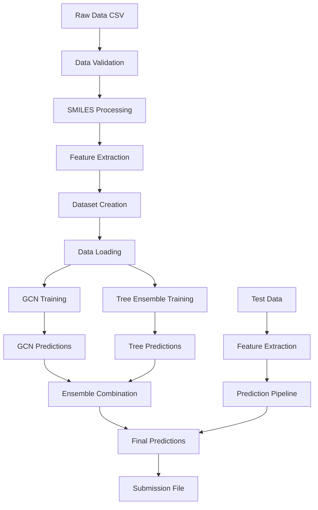

# Design Document

## Overview

This design addresses the critical issues in the polymer prediction pipeline by creating a robust, production-ready system that leverages existing well-tested components from the repository. The main focus is on fixing DataLoader compatibility issues, integrating existing modules, completing missing implementations, and establishing comprehensive testing.

The solution follows a modular architecture that separates concerns into distinct components: data processing, model training, ensemble methods, and evaluation. This design ensures maintainability, testability, and extensibility while addressing the immediate runtime errors.

## Architecture

### High-Level System Architecture

```
┌─────────────────────────────────────────────────────────────────┐
│                    Polymer Prediction System                    │
├─────────────────────────────────────────────────────────────────┤
│  Main Pipeline (python_sandbox/main_improved.py)               │
│  ├── Configuration Management                                   │
│  ├── Data Loading & Validation                                  │
│  ├── Feature Extraction                                         │
│  ├── Model Training (GCN + Tree Ensemble)                      │
│  ├── Ensemble Combination                                       │
│  └── Prediction & Submission Generation                         │
├─────────────────────────────────────────────────────────────────┤
│  Core Components (src/polymer_prediction/)                      │
│  ├── Data Module                                               │
│  │   ├── dataset.py (PolymerDataset)                          │
│  │   ├── validation.py (Data validation)                      │
│  │   └── featurization.py (SMILES to graph)                   │
│  ├── Models Module                                             │
│  │   ├── gcn.py (Graph Neural Network)                        │
│  │   └── ensemble.py (Tree models)                            │
│  ├── Training Module                                           │
│  │   ├── trainer.py (Training utilities)                      │
│  │   └── optimization.py (Hyperparameter tuning)              │
│  └── Utils Module                                              │
│      ├── metrics.py (Evaluation metrics)                       │
│      ├── logging.py (Structured logging)                       │
│      └── io.py (File operations)                               │
├─────────────────────────────────────────────────────────────────┤
│  Testing Framework (tests/)                                     │
│  ├── Unit Tests (test_*.py)                                    │
│  ├── Integration Tests                                          │
│  └── End-to-End Tests                                          │
└─────────────────────────────────────────────────────────────────┘
```

### Data Flow Architecture



## Components and Interfaces

### 1. Configuration Management

**Interface**: `Config` class with centralized settings
- **Purpose**: Manage all hyperparameters and system settings
- **Key Features**:
  - Environment-aware configuration (CPU/GPU detection)
  - Path management for different environments
  - Model hyperparameters
  - Training settings

```python
class Config:
    # Data paths
    DATA_PATH: str = 'info/'
    MODEL_SAVE_DIR: str = 'models/'
    
    # Model parameters
    BATCH_SIZE: int = 16  # CPU-optimized
    HIDDEN_CHANNELS: int = 128
    NUM_GCN_LAYERS: int = 3
    
    # Training parameters
    NUM_EPOCHS: int = 50
    LEARNING_RATE: float = 1e-3
    
    # Device configuration
    DEVICE: torch.device = torch.device('cpu')
```

### 2. Data Processing Module

**Interface**: Enhanced data processing with existing components
- **PolymerDataset**: Use existing implementation from `src/polymer_prediction/data/dataset.py`
- **Validation**: Integrate `src/polymer_prediction/data/validation.py`
- **Featurization**: Use `src/polymer_prediction/preprocessing/featurization.py`

**Key Improvements**:
- Fix DataLoader compatibility by using `torch_geometric.data.DataLoader`
- Implement proper error handling for invalid SMILES
- Add data caching for performance optimization
- Integrate existing validation utilities

```python
from torch_geometric.data import DataLoader  # Fix: Use PyG DataLoader
from polymer_prediction.data.dataset import PolymerDataset
from polymer_prediction.data.validation import validate_dataframe
```

### 3. Model Architecture

#### 3.1 Graph Neural Network (GCN)
**Interface**: Enhanced GCN model with proper multi-target support
- **Base**: Use existing model structure from repository
- **Enhancements**: 
  - Multi-target output (5 properties)
  - Proper batch normalization
  - Dropout for regularization
  - Masked loss computation

```python
class PolymerGCN(nn.Module):
    def __init__(self, num_atom_features, hidden_channels=128, num_gcn_layers=3):
        super().__init__()
        self.convs = nn.ModuleList()
        self.bns = nn.ModuleList()
        # ... layer definitions
        self.out = nn.Linear(hidden_channels, 5)  # 5 target properties
```

#### 3.2 Tree Ensemble Models
**Interface**: Complete implementation of tree-based models
- **Models**: LightGBM, XGBoost, CatBoost
- **Features**: Hyperparameter optimization with Optuna
- **Integration**: Proper cross-validation and ensemble combination

```python
class TreeEnsemble:
    def __init__(self, models=['lgbm', 'xgb', 'catboost']):
        self.models = models
        self.trained_models = {}
    
    def optimize_hyperparameters(self, X, y, model_type):
        # Optuna optimization implementation
        pass
    
    def train(self, X_train, y_train):
        # Train all models with optimized parameters
        pass
```

### 4. Training Module

**Interface**: Use existing training utilities with enhancements
- **Base**: `src/polymer_prediction/training/trainer.py`
- **Enhancements**:
  - Cross-validation for ensemble training
  - Proper memory management
  - Progress tracking and logging

```python
from polymer_prediction.training.trainer import (
    train_one_epoch, 
    evaluate, 
    predict,
    masked_mse_loss
)
```

### 5. Ensemble Combination

**Interface**: Stacking ensemble with meta-learning
- **Method**: Ridge regression for combining predictions
- **Cross-validation**: Proper out-of-fold predictions
- **Features**: Weighted combination based on model performance

```python
class StackingEnsemble:
    def __init__(self, base_models, meta_model=Ridge()):
        self.base_models = base_models
        self.meta_model = meta_model
    
    def fit(self, X, y):
        # Generate out-of-fold predictions
        # Train meta-model
        pass
    
    def predict(self, X):
        # Combine base model predictions
        pass
```

## Data Models

### Input Data Schema
```python
@dataclass
class TrainingData:
    id: int
    SMILES: str
    Tg: Optional[float]      # Glass transition temperature
    FFV: Optional[float]     # Fractional free volume
    Tc: Optional[float]      # Thermal conductivity
    Density: Optional[float] # Density
    Rg: Optional[float]      # Radius of gyration
```

### Feature Representations
```python
@dataclass
class MolecularFeatures:
    # RDKit descriptors (60 features)
    rdkit_descriptors: np.ndarray
    
    # Morgan fingerprints (2048 bits)
    morgan_fingerprint: np.ndarray
    
    # Graph representation
    graph_data: torch_geometric.data.Data
```

### Model Outputs
```python
@dataclass
class PredictionResult:
    id: int
    predictions: np.ndarray  # Shape: (5,) for 5 properties
    confidence: Optional[np.ndarray]  # Uncertainty estimates
```

## Error Handling

### 1. Data Processing Errors
- **Invalid SMILES**: Log warning, skip molecule, continue processing
- **Missing values**: Use existing masked loss implementation
- **File not found**: Provide clear error message with expected file locations

### 2. Model Training Errors
- **Memory errors**: Implement batch size reduction and garbage collection
- **Convergence issues**: Add early stopping and learning rate scheduling
- **Device errors**: Automatic fallback from GPU to CPU

### 3. Prediction Errors
- **Invalid test data**: Skip invalid samples, log warnings
- **Model loading errors**: Provide fallback to default model
- **Output formatting**: Validate submission format before saving

```python
class ErrorHandler:
    @staticmethod
    def handle_invalid_smiles(smiles: str, index: int) -> None:
        logger.warning(f"Invalid SMILES at index {index}: {smiles}")
    
    @staticmethod
    def handle_memory_error(batch_size: int) -> int:
        new_batch_size = max(1, batch_size // 2)
        logger.warning(f"Memory error: reducing batch size to {new_batch_size}")
        return new_batch_size
```

## Testing Strategy

### 1. Unit Tests
- **Data processing**: Test SMILES validation, feature extraction, dataset creation
- **Model components**: Test individual model layers, loss functions, metrics
- **Utilities**: Test configuration, logging, file I/O operations

### 2. Integration Tests
- **End-to-end pipeline**: Test complete training and prediction workflow
- **Model ensemble**: Test combination of GCN and tree models
- **Data flow**: Test data loading, processing, and output generation

### 3. Performance Tests
- **Memory usage**: Monitor memory consumption during training
- **Speed benchmarks**: Measure training and prediction times
- **Scalability**: Test with different dataset sizes

### 4. Error Handling Tests
- **Invalid inputs**: Test with malformed SMILES, missing files
- **Edge cases**: Test with empty datasets, single samples
- **Resource constraints**: Test behavior under memory/disk limitations

```python
class TestSuite:
    def test_data_loading(self):
        # Test CSV loading, validation, dataset creation
        pass
    
    def test_model_training(self):
        # Test GCN and tree model training
        pass
    
    def test_ensemble_combination(self):
        # Test stacking ensemble functionality
        pass
    
    def test_error_handling(self):
        # Test graceful error handling
        pass
```

## Performance Optimizations

### 1. Memory Management
- **Graph caching**: Cache processed graphs to avoid recomputation
- **Batch processing**: Optimize batch sizes for available memory
- **Garbage collection**: Explicit cleanup between training phases

### 2. Computational Efficiency
- **CPU optimization**: Use CPU-friendly batch sizes and model architectures
- **Parallel processing**: Utilize multiple cores for feature extraction
- **Model pruning**: Remove unnecessary complexity for CPU deployment

### 3. I/O Optimization
- **Data preprocessing**: Cache processed features to disk
- **Model checkpointing**: Save intermediate results to prevent data loss
- **Efficient file formats**: Use optimized formats for large datasets

## Deployment Considerations

### 1. Environment Compatibility
- **Python version**: Support Python 3.8+
- **Dependencies**: Pin versions for reproducibility
- **Hardware**: Automatic CPU/GPU detection and optimization

### 2. Configuration Management
- **Environment variables**: Support for different deployment environments
- **Path handling**: Robust path management across operating systems
- **Resource limits**: Automatic adaptation to available resources

### 3. Monitoring and Logging
- **Structured logging**: Use existing logging utilities
- **Progress tracking**: Detailed progress reporting for long-running tasks
- **Error reporting**: Comprehensive error logging and reporting